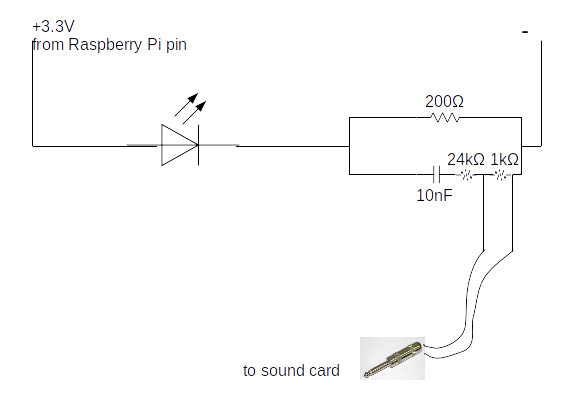

## Video annotation protocol (**Neetash and Aditya to fill this part out!!!!!!**)

1. Step 1
1. Step 2
1. Step 3
1. Step 4

Lorem ipsum dolor sit amet, consectetur adipiscing elit. Sed accumsan sem
arcu, a mattis purus luctus ut. Cras nibh mauris, vulputate a pharetra sed, ultricies
eget tellus. Cras euismod sit amet mauris nec sollicitudin. Aliquam sodales diam
eu est posuere, ut posuere nunc sagittis. In lacinia ornare nisi at efficitur. Donec
tempus sodales lorem, sit amet sodales quam dictum ac. Aliquam consectetur est sed
lorem tempus bibendum. Lorem ipsum dolor sit amet, consectetur adipiscing elit.
Sed accumsan sem arcu, a mattis purus luctus ut. Cras nibh mauris, vulputate a pharetra
sed, ultricies eget tellus. Cras euismod sit amet mauris nec sollicitudin. Aliquam
sodales diam eu est posuere, ut posuere nunc sagittis. In lacinia ornare nisi at
efficitur. Donec tempus sodales lorem, sit amet sodales quam dictum ac. Aliquam
consectetur est sed lorem tempus bibendum.Lorem ipsum dolor sit amet, consectetu

## Individual call selection protocol 

Protocol for manual measurements of horseshoe bat calls:  discussion over Skype by Aditya and Thejasvi 5/2/2020 (see email sent to HBC group on 5/2/2020 15:05).

* All measurements and signal processing will be done using Audacity. 
* dB rms measurements made with the 'Contrast' function in Audacity. Highpassing done with the inbuilt highpass filter. 

    1. Load annotation audio file, and delete all non-target channels. 
    2. View audio in spectrogram mode. Set dynamic range of audio to 60dB. 
    3. Set the highpass filter audio file with 12 dB roll off/octave at 80 kHz cutoff frequency
    4. For given audio file, choose  a start point using a random number generator between 0-1. 
    5. Go to that fraction of time corresponding to the length of the annotation audio file 
    6. Choose another random number between 0-1. If it's <=0.5 search towards left, else search towards right. 
    7. Look for a horseshoebat call with no overlaps, no interference patterns in the CF or FM, that can be isolated well. 
    8. While selecting horseshoe bat calls, zoom in max till 60 milliseconds of audio occupy the whole screen. Do not zoom in more or less while selecting. 
    9. Check the SNR of the selected horseshoe bat call by using a 'silent period' of the audio file as background.  If there is not suitably long 'silent period' to serve as background in this audio file, choose another random audio file and measure the background dB rms. 
        a. If SNR >= 20 dB:
            i. This is a suitable call to measure. 
            ii. Zoom to 60 ms resolution
            iii. Select whole call -> get dB rms
            iv. If there's two FM sweeps in the call, get dB rms of each FM sweep, else of just one. 
        b. If SNR < 20dB
            i. Go back to search start point calculated in 4), and begin searching in opposite direction. 
            ii. Look for first suitable call to measure using criteria in 5).
        c. If a suitable call is still NOT found:
            i. No measurement takes place in this audio annotation. Proceed to next audio annotation file.


### *Changes made to the original protocol*

* No manual measurements were made, aside from the broad start and end times of the identified call. Manual measurements such as FM/CF durations were considered too error-prone, and not reproducible. This was a major drive for the development of *itsfm*. 

## Notes on implementing the protocol of [@laurijssen2018low] 

A Raspberry Pi 3 was used to continuously generate binary ON/OFF voltage signals which was then used to drive an IR LED while the voltage spikes were recorded on the USG 416H running at 250 kHz sampling rate. 
To keep the setup field-friendly, an output pin of the Raspberry Pi was set to start producing the random ON/OFF signal as soon as the device was powered. Starting the ON/OFF routine has the advantage of minimising setup time, while also making troubleshooting or program alterations more involved. 

### The ON/OFF signal:

The continuous ON/OFF signal was generated with the following pseudo code (actual Python code available as a separate file):

```
# values between 0.08 and 0.5 seconds in steps of 0.1 milliseconds
range_of_durations = [0.08,0.0801, 0.0802….0.5] 

while True:
    1) Turn LED ON
    2) choose random ON duration from range_of_duration
    3) keep LED ON from random ON duration
    4) TURN LED OFF 
    5) choose random OFF duration from range_of_duration
    6) keep LED off for random OFF duration 
```

### The circuit to split the ON/OFF signal 


The main part of the circuit above is a voltage divider. The voltage divider ensures that one arm of the circuit gets low current. In this low current arm, the signal is lowpass filtered by a capacitor. An ON/OFF signal thus looks like a series of up and down spikes. If using an analog-to-digital convertor that can handle direct current signals - then the capacitor may not be necessary. The USG 416H (like many soundcards in the market) cannot record constant voltages and so a capacitor was used to generate 'ON' and 'OFF' spikes. The rising and descending flanks of the ON/OFF signal are registered as positive and negative spikes in the audio data.



### Things to consider:

#### The LED signal : 
The ON/OFF signal can be recovered looking at the brightness of the LED in a narrow region of interest in the video frames – this is reliable. However, because the DVR actually output files with a frame rate of 22 Hz, there will be some aliasing occuring. The ON/OFF signal has frequency components between 0.5-12.5 Hz, while the video file at 22 Hz has a Nyquist frequency at 11 Hz.
There may also be delays in the time taken to switch on the LED to full brightness – though given it's a small LED  - this should be less than 26 microseconds (source).

## Defining and implementing the measurement of dominant frequencies
Dominant frequencies are a proxy measure to try and capture the frequencies which may contribute largely to the power spectrum of an audio segment. In the case of an audio segment with multiple horseshoe bat calls, the dominant frequencies will correspond to the CF frequencies of each call.

Described below is the pseudo-code to measure the dominant frequencies in an audio segment. For the Python code implementation please see the function ```dominant_frequencies``` in the file 'inbuilt_measurement_functions.py' with the relative path: 'annotation_audio_analysis/measure_annot_audio/inbuilt_measurement_functions.py' 

*Pseudo-code to measure dominant frequencies*

```
1. Calculate raw power spectrum of input audio segment
2. Smoothen the raw power spectrum by the user-defined frequency width 
(eg. 100 Hz, which is then converted into the number of equivalent center frequency bands)
3. Detect all peaks in the smoothened power spectrum that are within *peak range* dB of
the highest peak.Each of the detected peaks must also be at least *inter-peak-distance*
apart in frequency.
4. All peaks that satisfy the peak range and inter-peak distance criteria are considered
dominant frequencies.
```

## The closest bat to the microphone dictates the final received level 
*Perform calculation of received levels with overlaps etc. When two bats are flying at 20cm and 1m distance from the mic, with the same source level. Also talk about how it is difficult to assess the real source level in turn because of call directionality.*


## Estimating Doppler shift in our spectral measurements 
Our bats fly towards and away from the microphones, likely at speeds between 1-3 m/s. To estimate the realistically expected Doppler shift, we also included a range of relative bat-mic flight angles. As shown in Figure 3, the maximum expected Doppler shifts lie between ~ $\pm$ 200-600 Hz (SI Figure 3), with higher speeds leading to higher Doppler shift. We do not consider the simplistic 'head-on' calculation with: $f=f_{emitted}\times \frac{c}{c-v_{headon}}$, but instead use the version of the equation that incorporates the relative speed in the direction of the receiver: $f=f_{emitted}\times \frac{c}{c-v_{headon}}cos\theta$


## References
