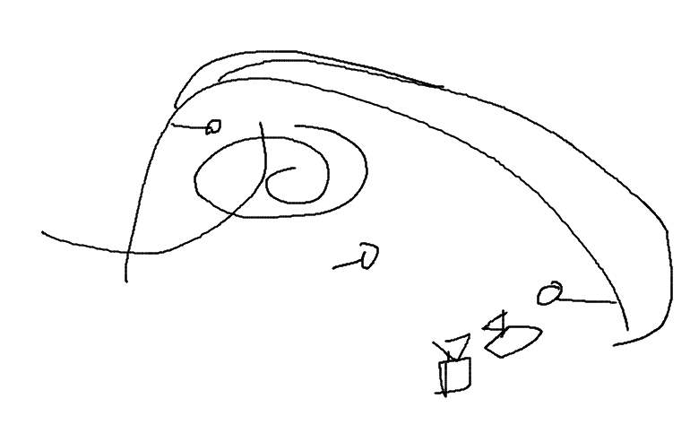
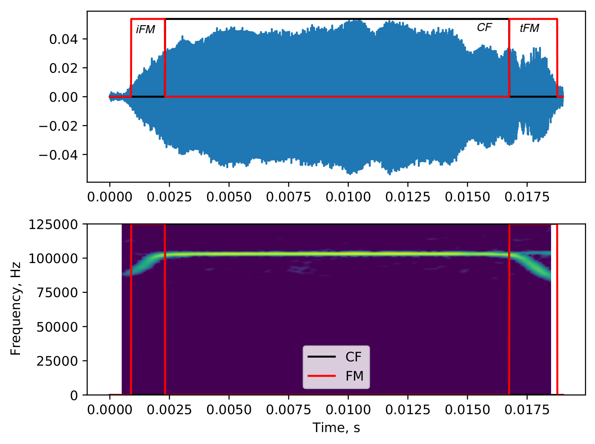
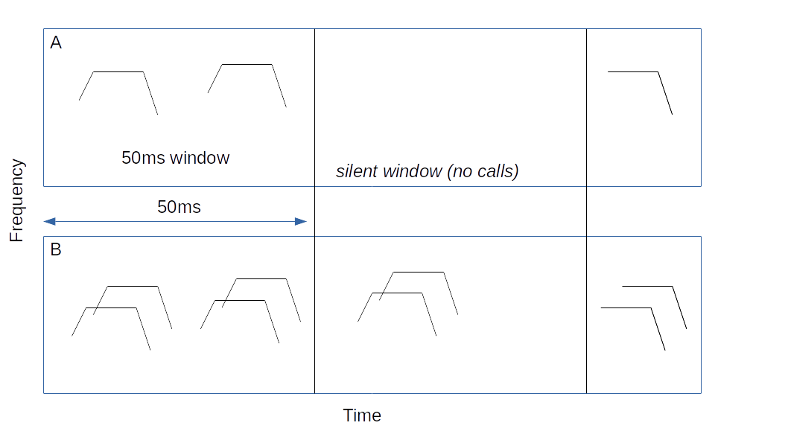
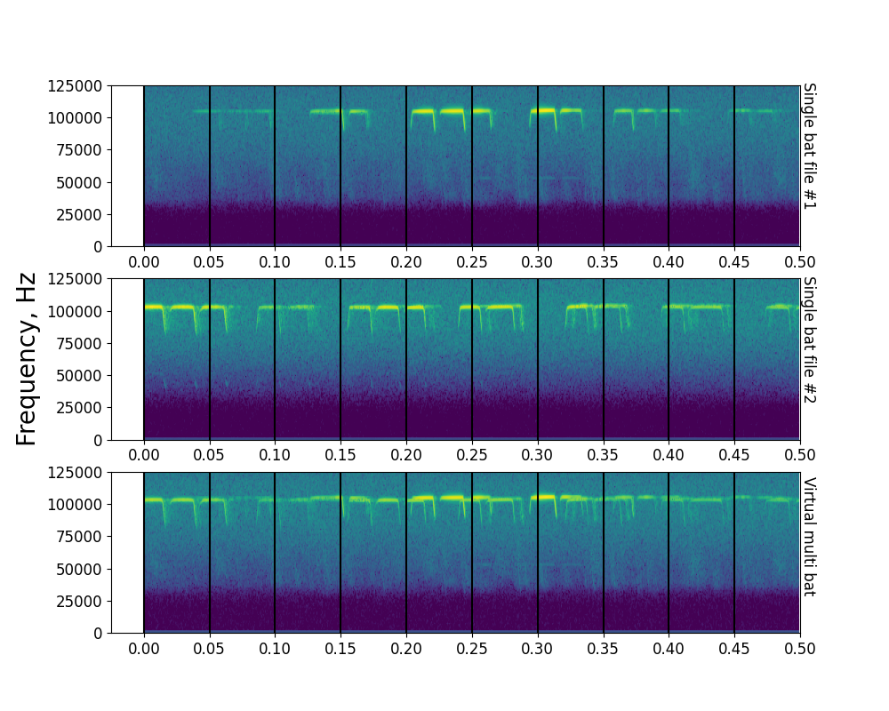
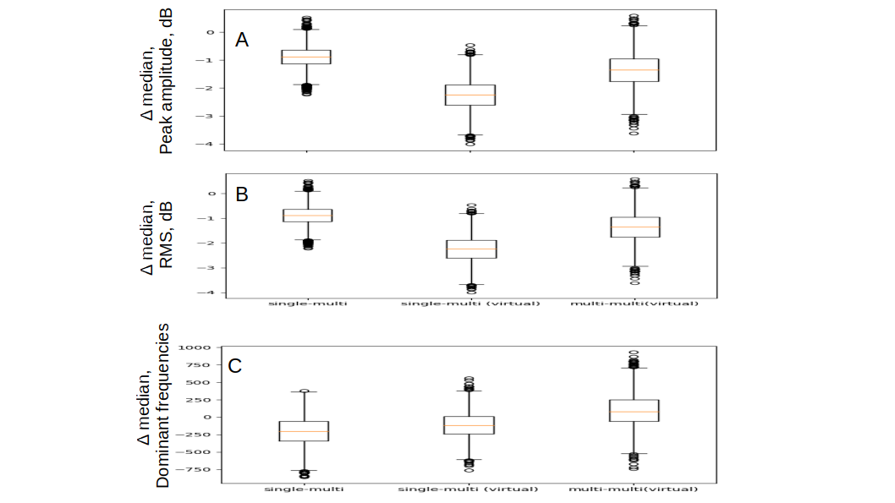

## Potential target journals

*Journals that have published similar work in th past, or papers that have been cited in this manuscript, in subjective order of prestige*

1. Journal of the Acoustical Society of America -  common for horseshoe bat /echolocation papers
1. Journal of Comparitive Physiology A
1. Journal of Experimental Biology (low cost paper and echolocation papers published here, but unlikely to get through because they would like an explicit manipulative aspect to the paper.)
1. Biology Open (The company of Biologists) - Fawcett et al. 2015 published here

*Other alternate journals*

1. Royal Society Open Science
1. Open Biology (Royal Society) 
1. Acta Chiropterologica

## Introduction (BROAD DRAFT, OTHERS  CHIP IN!)

- Bats are known to echolocate and fly under complex conditions. They show responses in the presence of conspecifics, playbacks and clutter. 

- There is a general FM bat bias in the study of how bats respond to adverse acoustic conditions, with little attention given to CF bats. Even in the CF bat literature, there is a strong focus on lab based studies.

- Lab based studies are powerful in that they can shed clearer light into the contributions of the manipulated variables and conditions. However, at the same time, the animals are in a new environment, and the environment itself can be a strong manipulating variable. Studying animals in natural conditions allows quantifying the day-to-day effect sizes as seen in the wild as the animal behaves in its natural environment. 

- A common issue plaguing many acoustical studies, especially in bat echolocation is the use of manual measurements to segment and quantify the different parts of an echolocation call (CF, FM). These are known to lead to biased or inconsistent measurement. We overcome these issues with the use a of an automated workflow. Our approach is thus more reproducible in the long-term. 

- We observed and compared the behaviour of free-flying bats as they echolocated alone and in the presence congeners emitting echolocation calls in a common frequency band. Our observations of free-flying bats show that changes in echolocation may not be as dramatic as observed in previous studies, perhaps due to the fact that the animals are flying in a familiar environment. Bats may be even less affected by so-called jamming in their native habitats.

## Methods

### Study species
Two target species of rhinolophid bats *Rhinolophus mehelyi* and *R. euryale* were studied. Both species emit CF calls with peak frequencies between 102-112 kHz, and they cannot be distinguished reliably acoustically due to the overlap of call frequencies. For the purposes of this study we treat them as a single group of bats as the problem of acoustic jamming still remains whether a bat faces loud calls from a conspecific or a heterospecific due to the major overlap in CF frequencies, and similar call structure.

Recordings were done in a dome-shaped cave next to the main entrance of the Orlova Chuka cave system. The dome was **X,Y,Z** (HxBXD) metres in dimension. Our data showed that the recording site was visited by multiple species of bats aside from our two main study species, and we only analysed audio data with *R. euryale* and/or *R. mehelyi* calls in it. 

### Experimental setup

Three Avisoft CM16 microphones (Avisoft Bioacoustics, Germany) were connected to an Avisoft 416H recording at 250kHz sampling rate. The three microphones were placed at different heights and locations in the dome shaped cave to sample the greatest diversity of calls possible. The cave had only one entrance/exit with a roosting site that most bats flew towards (Figure 1.). Horseshoe bat calls are known to be directional [@matsuta2013adaptive], and the mics were placed at different positions to increase the number of on-axis calls captured. Microphones were placed in the same location with +/- 10cm error in the cave across multiple nights. The fourth channel of the Avisoft 416H was used to record the audio sync signal described in the section below. Audio was recorded continuously through the night in the form of consecutive multichannel files of 1 minute length.

Two consumer grade CCTV cameras were connected to a digital video recorder to record the flight of bats as they flew in and out of the cave. While mostly recording at 22 Hz, the cameras showed frame rates between 18-27 Hz, frame drops, and did not always record synchronously. However, we were still able to view a bat flight bout on both cameras due to the common burnt-in timestamps on each frame. The two cameras were placed in approximately the same position on every recording night. The cameras were so placed to maximise the total cave area recorded while also capturing the video-sync signal in the form of a blinking LED light. Recording sessions with both cameras showing stable field-of-views were analysed. Regions of the video files with stable camera positions were analysed. Video was recorded continuously through the night and resulted in two video files (one per camera) for each recorded hour.

The audio and video feeds were synchronised using the low-cost method described in [@laurijssen2018low]. Briefly, ON-OFF signals between 0.08-0.5 seconds was generated and fed into the fourth audio channel of the USG 416H and used to drive the blinking of an LED. The random ON-OFF signal was generated by a Raspberry Pi (See Supplementary Information for script, circuit and associated notes). 

### Identifying single and multi bat occurences
Bat activity in the cave was recorded for at total of about 18 hours over four nights in the cave. Bats flew into the cave, and either headed straight for the roosting site or performed circling flights within the cave and exited. Bats also flew from the roosting site out of the cave. Most of the entries and exits observed were with single bats (%AGE HERE), and a minority of bat flights in the cave were with more than one bat (%AGE HERE). 

The start and end of all bat flight bouts in each video were manually annotated by an observer following a series of pre-defined criteria to ensure repeatability (See Supplementary Information). Each flight bout annotation recorded the number of flying bats as seen over the two camera views.

### Video-audio synchronisation 
For each video annotation, we attempted to match a corresponding region of the recorded audio file. This was done by cross-correlating the blinking LED signal over the video annotation window with the recorded ON/OFF signal in the fourth audio channel. We managed to find succesful audio matches for ABC % of all video annotations. The low match rate is primarily due to the fluctuating nature of the camera frame rates. For each succesfully matched video annotation, there was now an audio file that recorded the echolocation behaviour at the observed group size. Due to issues with synchronisation audio data from only 11 hours 40 minutes of the around 18 hours could be succesfully synchronised to get analysable audio data.

## Acoustic analysis
We performed two complementary acoustic analyses to determine whether horseshoe bats changed their echolocation call parameters while flying in the presence of conspecifics. The first analysis is the 'individual call' analysis, where we isolated one horseshoe bat call in each synchronised audio file, and performed measurements on it. The second analysis is the 'whole audio' analysis, where we measured the acoustic parameters of longer 50ms chunks from a whole audio file. The advantage of the single-call analysis is that the measurements made on single calls are directly interpretable, in terms of which parameters were altered while bats were flying alone or with conspecifics. The disadvantage of the single-call analysis is that especially in multi-bat annotations, it can be difficult to find enough cases of non-overlapped calls of sufficient signal-to-noise ratio. The advantages of the whole-audio analysis is that it allows a broader scale characterisation of the echolocation, by allowing an analysis of more audio data. Whole-audio analysis also allows a kind of null-hypothesis testing where 'simulated' multi-bat audio files can be made for comparison. 

All raw audio was first forward-backward high-passed filtered at 70 kHz before analyses were performed. The video annotation matched audio files showed a mix of multiple species echolocating in them. Even though audio was recorded from three microphones simultaneously, later inspection showed that the first microphone, (placed slightly above the ground towards the entrance) provided call recordings with the highest signal-to-noise ratio. All analysed audio data were thus taken from the first recorded channel. This microphone was also ideally located to record the calls of both incoming and exiting bats. Multiple species were seen in the audio files because during video annotation it was not possible to distinguish bat species solely by their flight behaviour. The other bat calls that were recorded were from *R. ferrumequinum* and a series of vespertionid and miniopterid FM calls, all of which are known to occur in the Orlova Chuka cave system [@ivanova2005important]. Even though most of our audio recordings had *R. mehelyi* and *R. euryale* calls, there were recordings with single or multiple bats with one or more non-target species. These recordings were discarded and not analysed. Only verified video recordings with audio containing either of the target species was analysed. 

### Individual call measurements
Individual calls which were not overlapped by other calls and sufficient signal-to-noise ratio (Figure 2) were manually chosen through a random search protocol (Supplementary Information). Briefly, an experimenter began at a random point in an audio file. From this point, the experimenter randomly began searching to the left or right until a suitable horseshoebat call could be identified. The start and end time of this call in the audio file were noted.

The FM and CF parts of the call were segmented automatically and acoustic parameters such as peak amplitude, rms, peak frequency and terminal frequency were measured using the *itsfm* package [UPLOAD TO BIORXIV NOWWWWW]. Calls were automatically segmented into their corresponding parts (iFM, tFM or CF) as per the terminology of [@tian1997echolocation] (Figure 2).For each segmented call region the following measurements were performed 1) peak amplitude 2) RMS 3) Lowest frequency (from -10 dB peak frequency). The end output of this analysis is a series of measurements for each CF and FM region of all the identified individual calls. The comparison in the individual-call analysis is between the measurements of all the CF and FM regions between single and multi bat calls. 

### Whole audio measurements 
Entire annotation matched audio files were analysed to try and quantify how audio of entire call sequences were across single and multiple bat contexts. Each audio file was split into consecutive windows of around 50ms (Figure 3.). 50ms was chosen as it was about twice the duration of an average horseshoe bat call in our data, 
and also matched the the longest call durations observed. This ensured that when there was a horseshoe bat call in a window, it would mostly be a whole audio call.

Over the course of an audio file, there could be multiple windows without calls in them. These 'silent' windows (Figure 3.) were removed from the analysis, and only the 'non-silent' windows with bat calls in them were analysed. On each non-silent window, acoustic measurements were performed, including determining the peak amplitude, rms, and dominant frequencies of the audio in the window. Dominant frequencies here are defined as frequency peaks in the power spectrum that are within a threshold level of the peak frequency. Dominant frequencies are extracted from the various peaks of the power spectrum means and thus are a proxy measurement for the CF frequencies of calls in a window. In a window with one bat call, there are likely to be a few dominant frequencies, while a window with many bat calls are likely to have more dominant frequencies. The end output of this analysis is a series of measurements for each window in an audio file. See this detailed whole audio page The comparison made here is between the 'window' measurements of single and multi bat audio files. See Supplementary Information for more details. 

The comparison here is between the acoustic measurements performed on the audio windows from single and multiple bat contexts. 

## Statistical analysis 

### Single call measurements

#### Quantifying distribution overlap

To compare the properties of calls emitted in single and multi bat contexts - we generated the underlying probability distribution function (PDF) of the data through kernel density estimates for each context. The overlap between the single and multi bat PDF was quantified by the Bhattacharyya coefficient (Bhattacharya 1943). The Bhattacharya coefficient is a distance measure which quantifies the overlap of two distributions. When two distributions do not overlap at all, it is zero, and with greater overlap the coefficient increases. 

#### Identifying the difference between single and multi bat calls

The presence of a difference between single and multi bat call parameters were tested by a 'shuffle-overlap' procedure, by comparing the overlap from observed and shuffled groups. If the call properties of single and multi bat calls were indeed indistuinguishable, we expect that the observed overlap would fall into the typically expected range of the shuffled data. If however the single and multi bat call parameters did indeed form separate distributions, we would expect the overlap to be lower than that obtained from shuffling. The 'extremeness' of the observed data can be measured by its percentile value with respect to the shuffled data.

For further details on the shuffle-overlap procedure please see the SI.

#### Power analysis to determine the minimum detectable effect sizes (to present or not to present?????)

Given our samples sizes and statistical test, we wanted to assess if it would lead to a true positive result at the minimum detectable effect (MDE). The MDE was determined with reference to a previous study [@fawcett2015echolocation] which had performed a similar study on a different species (R. capensis). The MDE's from Fawcett et al. 2015 serve a good starting point, even though they may not reflect the exact effect sizes expected from our own study. We chose not to perform a post-hoc power analysis as effect sizes are poorly estimated under limited sample sizes [@daniellakensa_2016;@zhang2019post].

Our power analysis revealed sufficient power (> 80%) for the following tests for the following parameters peak frequency, tFM duration, call duration, . The following comparisons were had a power < 80 % at the parametrised effect sizes. It is important to note that the effect sizes in the Fawcett et al. 2015 are a first order approximation of the actual effect sizes that could be seen in our data.

For further information on the MDE power analysis please see the SI.

### Whole audio measurements

To assess if bats in groups showed different acoustic properties in the chosen windows than those echolocating alone we calculated the bootstrapped difference in medians for the three types of audio sequences (single, multi, virtual-multi): single - multi, single - virtual-multi, multi - virtual-multi. The comparisons were performed for each measured parameter. The data for each measured parameter consisted of measurements arising from the multiple windows in each audio file. To reduce the extent of pseudo-replication in the dataset, we performed a bootstrapping in the following manner:

1. Begin bootstrapping round
1. For each audio file in the dataset choose measurement value from a single window
1. Split data into groups according to the number of bats (single/multi/virtual-multi)
1. Subtract the median values of the two datasets of interest (eg. single-multi)
1. Store the difference in median values and proceed to 1.

### Software packages used in this paper
This paper was enabled by a series of open-source packages. Signal analysis, data manipulation and visualisation were done in Python [@van1995python] through its scientific ecosystem: the scipy, numpy, matplotlib and pandas packages [@2020SciPy;@numpy;@matplotlib;@pandas]. Reproducible analysis, documentation and presentation were enabled by the Jupyter Notebook and rmarkdown projects[@jupyter;@rmarkdown]. Audio visualisation, preliminary measurements and single call annotations were done with the help of Audacity [@audacity].

## Results

### Single-call comparison

Lorem ipsum dolor sit amet, consetetur sadipscing elitr, sed diam nonumy eirmod tempor invidunt ut labore et dolore magna aliquyam erat, sed diam voluptua. At vero eos et accusam et justo duo dolores et ea rebum. Stet clita kasd gubergren, no sea takimata sanctus est Lorem ipsum dolor sit amet. Lorem ipsum dolor sit amet, consetetur sadipscing elitr, sed diam nonumy eirmod tempor invidunt ut labore et dolore magna aliquyam erat, sed diam voluptua. At vero eos et accusam et justo duo dolores et ea rebum. Stet clita kasd gubergren, no sea takimata sanctus est Lorem ipsum dolor sit amet.

### Whole-audio comparison

Lorem ipsum dolor sit amet, consetetur sadipscing elitr, sed diam nonumy eirmod tempor invidunt ut labore et dolore magna aliquyam erat, sed diam voluptua. At vero eos et accusam et justo duo dolores et ea rebum. Stet clita kasd gubergren, no sea takimata sanctus est Lorem ipsum dolor sit amet. Lorem ipsum dolor sit amet, consetetur sadipscing elitr, sed diam nonumy eirmod tempor invidunt ut labore et dolore magna aliquyam erat, sed diam voluptua. At vero eos et accusam et justo duo dolores et ea rebum. Stet clita kasd gubergren, no sea takimata sanctus est Lorem ipsum dolor sit amet.

## Discussion (BROAD DRAFT, OTHERS  CHIP IN!)

- **importance of field studies**: Bats may not show the same kinds of dramatic responses to conspecifics when studied in their natural habitat. Despite its challenging nature, we stress the importance of observing echolocation/behaviour in the wild. 
- We also present a method to assess differences in call behaviour with overlapping calls in the form of 'windows' than can incorporate a few calls. 
- One important aspect of the dataset missing in our study is the position of the bats as they called. 
- It maybe surprising that single and multi-bat audio windows didn't seem to show very much difference. This does not mean that bats did  not change their source level, and may be explained by a simple geometric consideration. The simplest factor is that when two sounds overlap, their dB received level is often dominated by the loudest sound. This means that in our case, when two bats fly past each other, one bat is always closer to the microphone - and its call is likely to dominate the measured received level (See Supplementary Information). Assessing source levels from the received levels requires knowledge of the bat positions. The source level calculations are in turn challenging due to the overlap of calls. One solution despite the presence of overlap is to exploit the slight interindividual difference in CF peak frequencies, and infer the individual call received levels from the power spectrum, and thus back calculate the source levels of the two overlapping calls. 
- Peak frequencies in individual calls and dominant frequencies in the audio windows did not show a systematic difference across single and multiple bat. This hints at the possibility that bats may not be altering the CF portions of their calls very much, or at least, not in a uni-directional manner. Without knowledge of the exact speed and orientation of the bat's flight while it emitted calls, the recorded calls may have had a Doppler shift of betwee $\pm$ 200-600 Hz (Supplementary Information) as they flew towards and away from the microphone at an estimated speed of between 1-3 m/s. If the bats had indeed shown a unidirectional increase or decrease in their peak frequency when in the presence of others, then we would have been able to detect the change despite the Doppler shifts, which are both postive and negative in their effect. 
- 

## Associated data and code 
All data and code used to generate the results and figures in the paper are available in the Zenodo repository [INSERT DOI HERE]. 

## Acknowledgements (*Is there anyone else!!???*)
The authors would like to specially thank the electronics team (Markus Abels, Hannes Sagunsky, Reinhard Biller) at the MPIO workshop for help preparing the electronic circuits to run the ON/OFF signal splitting. We would also like to thank Antoniya Hubancheva for logistical support, Stefan Greif for help collecting the data, the 2018 Tabachka field crew and Diana Schoeppler and Hans-Ulrich Schnitzler for their helpful discussions. We thank the reviewers for their feedback which improved this paper. TB was funded by a DAAD doctoral fellowship and the IMPRS for Organismal Biology, HRG was funded by the Emmy Noether program of the DFG (German Research Foundation). 

## Author Contributions 
Study design and conception: TB,NMR Data collection: NMR, TB, AK, Audio and video annotation: AK,NM Audio-video synchronisation: TB Analysis: TB,NMR,HRG Interpretation of results: NMR, TB, HRG Manuscript preparation: NMR, TB, HRG. All authors read and approved the final draft of this paper

## References 
